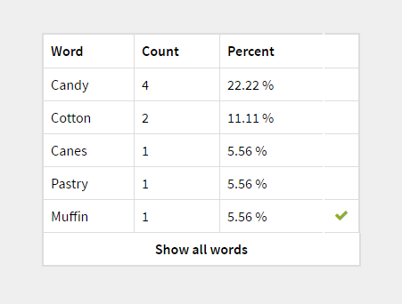
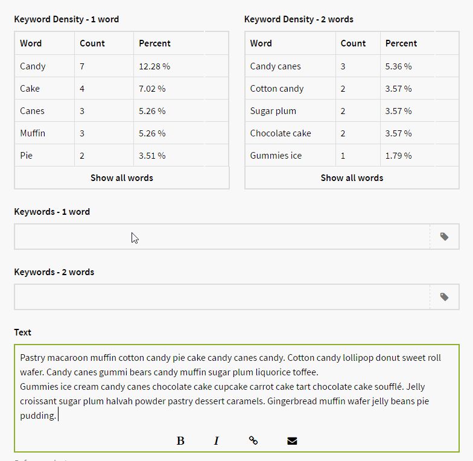

# Kirby Keyword Density

*Version 0.1*

To make your page rank in the search engines, make sure that you have the important words in your text. This plugin will help you with that. Read more about keyword density on [Wikipedia](https://en.wikipedia.org/wiki/Keyword_density).

**Screenshot**



**Animation**



## Installation

Use one of the alternatives below.

### 1. Kirby CLI

If you are using the [Kirby CLI](https://github.com/getkirby/cli) you can install this plugin by running the following commands in your shell:

```
$ cd path/to/kirby
$ kirby plugin:install jenstornell/kirby-keyword-density
```

### 2. Clone or download

1. [Clone](https://github.com/jenstornell/kirby-keyword-density.git) or [download](https://github.com/jenstornell/kirby-keyword-density/archive/master.zip)  this repository.
2. Unzip the archive if needed and rename the folder to `kirby-keyword-density`.

**Make sure that the plugin folder structure looks like this:**

```
site/plugins/kirby-keyword-density/
```

### 3. Git Submodule

If you know your way around Git, you can download this plugin as a submodule:

```
$ cd path/to/kirby
$ git submodule add https://github.com/jenstornell/kirby-keyword-density site/plugins/kirby-keyword-density
```

## Blueprint

To make it work as expected, add the following code to your blueprint:

```
fields:
  density:
    label: Keyword Density
    type: density    
    text:
      - my_text
      - my_other_text
    limit: 5
    words: 2
    keywords: my_keywords
  my_text:
    label: My text
    type: textarea
  my_other_text:
    label: My other text
    type: textarea
  keywords:
    label: Keywords
    type: tags
```

### type

It has to be `density` which is this field.

### text

To know from what texts you want the keyword density field to take words from, you need to add some field names, like this:

```
text:
  - my_text
  - my_other_text
```

It will only work with input fields. `textarea` and `text` are input fields.

You can also add a single value like this:

```
text: my_text
```

### limit (optional)

If you don't want a long list of keywords in your keyword density field, you can set a `limit`. Even if you set a limit you can see all the words with a click of a button.

### words (optional)

If you don't set anything it will split the text into single words. You can change it to 2 or 3 words.

### keywords (optional)

With all the words in the list it can be hard to spot the important keywords. To make it easier you can add a `tags` field that you fill with your keywords. The tags (keywords) are highlighted in the density field keyword list.

## Usage

When your blueprint is set up you can try to write something in the fields you have in `text`. Keywords should start to pop up in the keyword density field.

## Changelog

**0.1**

- Initial release

## Requirements

- [**Kirby**](https://getkirby.com/) 2.3+

## Disclaimer

This plugin is provided "as is" with no guarantee. Use it at your own risk and always test it yourself before using it in a production environment. If you find any issues, please [create a new issue](https://github.com/jenstornell/kirby-keyword-density/issues/new).

## License

[MIT](https://opensource.org/licenses/MIT)

It is discouraged to use this plugin in any project that promotes racism, sexism, homophobia, animal abuse, violence or any other form of hate speech.

## Credits

- [Jens Törnell](https://github.com/jenstornell)